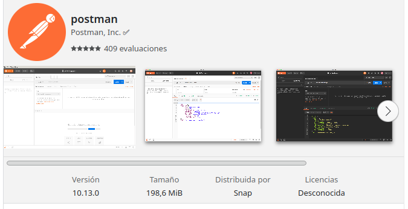
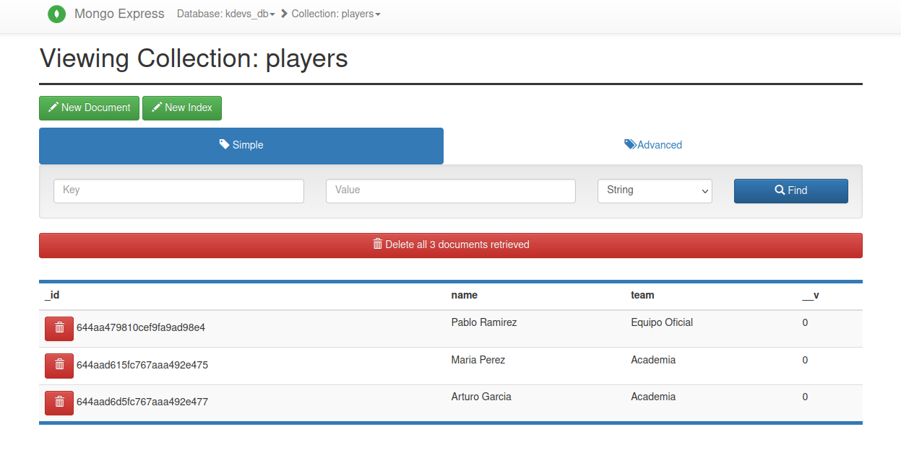
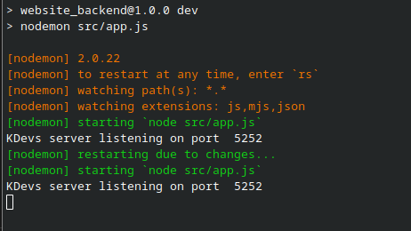
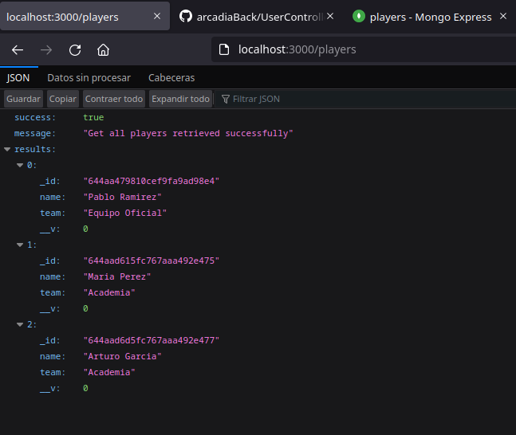
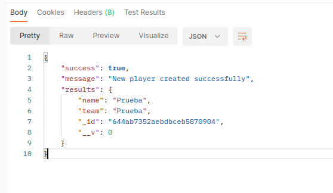
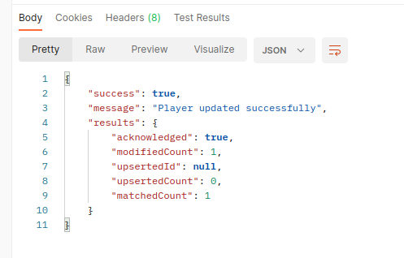
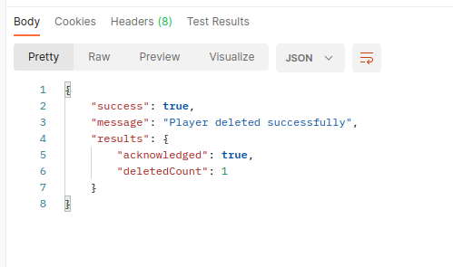

# Kalamity Web Backend
Backend para la Web desarrollada por KalamityDevs 


## Códigos de estado HTTP


| Respuesta                     | Descripción                                                                                      
| ----------------------------- | ------------------------------------------------------------------------------------------------ 
| `200 (OK)`                    | Indica que la petición ha tenido éxito                                                           
| `201 (Created)`               | Indica que el recurso se ha creado con éxito                                                     
| `400 (Bad Request)`           | Indica que el servidor no puede entender la petición                                             
| `401 (Unauthorized)`          | Indica que la petición no tiene información de autenticación y el servidor la solicita           
| `403 (Forbidden)`             | Indica que la petición no tiene acceso a ese recurso por falta de privilegios                    
| `404 (Not Found)`             | Indica que el servidor no encuentra ese recurso                                                  
| `500 (Internal Server Error)` | Indica un fallo desconocido del servidor                                                         


## Librerias utilizadas


Lenguaje de programación **Javascript** con Node. Para utilizar el gestor de paquetes **npm**
```
sudo dnf install nodejs
```
```
sudo npm install -g npm@9.6.5
```
Servidor **Express** para recibir peticiones en un puerto de escucha
```
sudo npm install express --save
```
Paquete **Nodemon** para reiniciar el servidor en tiempo real
```
sudo npm install nodemon --save
```
Paquete **DotEnv** para utilizar variables de entorno en un archivo *.env*
```
sudo npm install dotenv --save
```
Paquete **Cors** para proporcionar *Middleware* a la aplicación y configurar peticiones *API Rest*
```
sudo npm install cors --save
```
Paquete **Mongoose** para trabajar consultas de base de datos MongoDB
```
sudo npm install mongoose --save
```

## Funcionamiento
- La primera vez, el proyecto necesitará instalar sus dependencias y crear la carpeta *node_modules*

````
sudo npm cache clean --force

sudo npm install
````

- Para arrancar el servidor *modo desarrollo*
````
npm run dev
````


## IDE recomendado


## Herramientas de pruebas recomendada



## Panel de acceso base de datos




## Visuales del proyecto
### Consola

### Ruta principal
```
GET localhost:3000
```

### Mostrar jugadores
```
GET localhost:3000/players
```

### Crear jugador
```
POST localhost:3000/players/create
```
 |  Body  |                                                                   
 | ------------ |
 | `{"name": "Pablo", "team":"Equipo Oficial" }` |


### Actualizar jugador
```
PUT localhost:3000/players/update/:id
```
| Query Params |  Body  |                                                                   
| ------------ | ------------ |
| `id: 1520045` | `{"name": "Pablo", "team":"Academia" }` |


### Borrar jugador
```
DELETE localhost:3000/players/delete/:id
```
| Query Params |                                                                       
| ------------ |
| `id: 1520045` |
                    



## Reglas


- Utilizar siempre **git pull** antes de escribir código nuevo, para tener actualizado los últimos cambios.
- Los **git commit** deben ser entendibles para todos.
- En el **readme** se ponen explicaciones sólo cuando sea relevante.
- Las **funciones / métodos** deben estar siempre comentados.
- Intentar refactorizar el **código** siempre que sea posible.


