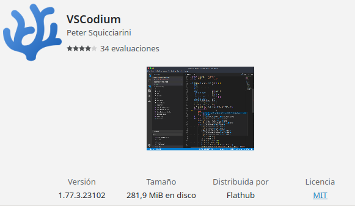

# Kalamity Web Backend
Backend para la Web desarrollada por KalamityDevs 


## Librerias utilizadas
___

Lenguaje de programación **Javascript** con Node. Para utilizar el gestor de paquetes **npm**
```
$ sudo dnf install nodejs
$ npm install -g npm@9.6.5
```
Servidor **Express** para recibir peticiones en un puerto de escucha
```
$ npm install express --save
```
Paquete **Nodemon** para reiniciar el servidor en tiempo real
```
$ npm install nodemon --save
```
Paquete **DotEnv** para utilizar variables de entorno en un archivo *.env*
```
$ npm install dotenv --save
```
Paquete **Cors** para proporcionar *Middleware* a la aplicación y configurar peticiones *API Rest*
```
$ npm install cors --save
```

## IDE Recomendado
___


## Reglas
___

- Utilizar siempre **git pull** antes de escribir código nuevo, para tener actualizado los últimos cambios.
- Los **git commit** deben ser entendibles para todos.
- En el **readme** se ponen explicaciones sólo cuando sea relevante.
- Las **funciones / métodos** deben estar siempre comentados.
- Intentar refactorizar el **código** siempre que sea posible.
